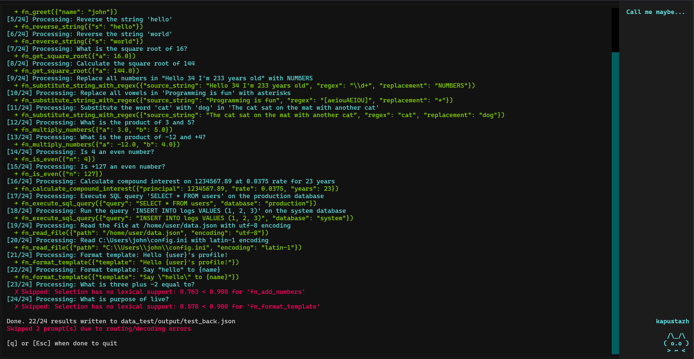

*This project has been created as part of the 42 curriculum by mnestere.*

# call_me_maybe

Small-model **function calling**: read prompts and a function schema (JSON),
pick a function with the LM under a confidence gate, fill typed parameters
with constrained decoding (logit masking), and write a JSON array of results.

Reliable structured output from a ~0.6B causal LM (`Qwen/Qwen3-0.6B` by default
via `llm_sdk`), not free-form JSON from the model alone. The pipeline loads
inputs with **Pydantic**, runs **logit-masked** literal generation per parameter
type, and shows **per-prompt progress** in the terminal.

## Quick start

**Prerequisites:** Python ≥ 3.11, [uv](https://github.com/astral-sh/uv), enough
disk/RAM for the Hugging Face checkpoint (first run downloads weights).

```bash
make install
make run              # 11 prompts, default schema under data/
make run-extended     # 24 prompts (extended tool set)
make run-nested       # 12 prompts with nested object parameters
make test             # unit tests (no live model)
make lint             # flake8 + mypy
```

## Terminal UI



When stdout is an interactive terminal, the run uses a **split-screen** view:
progress and messages on one side, a **sidebar art / animation** panel on the
other, with **color** where the terminal supports it. Text appears in a
**streaming** style so long lines do not dump all at once.

If the fancy UI cannot start (e.g. piped output, automated tests), the same run
falls back to **normal line printing** on stdout/stderr.

After all prompts finish, the program **waits** so you can read the log: when at
least one call succeeded, the done line is shown first; when every prompt failed
in the TUI, a short **0/N OK** summary is shown instead (still no output file).
Press **q** or **Esc** once to see a short **confirm** line; press **q** or
**Esc** again to leave. Any other key **cancels** that confirm and returns to
the log. Pressing **Ctrl+C** in that waiting state exits cleanly too.

Details and timing defaults live in [`src/render.py`](src/render.py).

## Makefile

| Target | Description |
|--------|-------------|
| `make install` | `uv sync`, Python 3.11 |
| `make run` | Default dataset (`data/`), optional `ARGS="..."` |
| `make run-extended` | Extended dataset (`data_test/`, 24 prompts) |
| `make run-nested` | Nested object params (`data_test_nested/`, 12 prompts) |
| `make test` | `pytest` in `tests/` |
| `make lint` | flake8 + mypy |
| `make lint-strict` | mypy `--strict` |
| `make debug` | Run under `pdb` (optional `ARGS`) |
| `make clean` | Remove caches and `.venv` |

Override paths for a one-off run:

```bash
make run ARGS='--input path/to/tests.json --output path/to/out.json'
```

## Datasets

Each `make run-*` target uses a **matching** definitions file and prompt set.
Using the wrong schema splits probability mass across unrelated tools.

| Command | Prompts | Definitions | Input | Output |
|---------|---------|-------------|-------|--------|
| `make run` | 11 | `data/input/functions_definition.json` | `data/input/function_calling_tests.json` | `data/output/function_calling_results.json` |
| `make run-extended` | 24 | `data_test/input/functions_definition.json` | `data_test/input/function_calling_tests.json` | `data_test/output/function_calling_results.json` |
| `make run-nested` | 12 | `data_test_nested/input/functions_definition_nested_object.json` | `data_test_nested/input/function_calling_tests.json` | `data_test_nested/output/function_calling_results.json` |

## Output format

Each successful call is one object in a JSON array:

```json
{
  "prompt": "...",
  "name": "fn_example",
  "parameters": { "...": "..." }
}
```

Rows that fail selection or decoding are skipped (message on stderr); the output
file lists only successful calls. If every prompt fails, no output file is written;
the plain CLI path then exits with code 1, while the interactive TUI stays open
with a summary until you quit (`q` / `Esc`).

## CLI flags

Same flags as `uv run -m src …`:

| Flag | Default |
|------|---------|
| `--functions_definition` | `data/input/functions_definition.json` |
| `--input` | `data/input/function_calling_tests.json` |
| `--output` | `data/output/function_calling_results.json` |
| `--model_name` | `Qwen/Qwen3-0.6B` |

**Model selection:** pass a Hugging Face model id to `Small_LLM_Model`.

- CLI: `--model_name "HF/model-id"` (empty/whitespace keeps SDK default)
- Code: `Pipeline(..., model_name="HF/model-id")`

## Algorithm (short)

1. Load and validate JSON inputs with Pydantic. Function definitions are
   **deduplicated by name** (first wins) to avoid splitting probability mass.
2. Select function name with the LLM:
   - Build a selection prompt listing tools and asking for the correct one.
   - Use the **longest common prefix** of all tool names so all candidates share
     the same prompt ending at token level.
   - Score candidates from model logits at the decision boundary, apply softmax,
     then enforce a **minimum confidence threshold**.
3. Decode parameters for chosen function:
   - Generate each JSON literal with **logit masking** (constrained decoding)
     so only type-valid tokens are allowed.

## Design choices

- **Constrained decoding** for literals → syntactically valid JSON fragments.
- **Schema-driven loop** over `parameters` — no per-function hardcoded keys in
  the decoder core.
- **Tokenizer JSON first**, flat vocab fallback (`TokenizerVocab`) so masks
  match the loaded model.
- **No prompt heuristics** — function choice and parameter values come from the
  LLM under constraints only.

## Performance and reliability

- One forward per selection step at the boundary; extra forwards only for
  tied first tokens (shared BPE prefix).
- Candidate token **pools per JSON type** built once at decoder init.
- Bounded `max_new_tokens` per literal decode.

## Testing

```bash
make test
```

Runs [`tests/`](tests/) with **pytest** (no GPU or live model download):

- tokenizer / vocab loading
- function selector (LCP prefix, confidence gate)
- constrained decoder
- pipeline golden path with a fake model
- nested `object` parameters

## Resources

- Logit: https://en.wikipedia.org/wiki/Logit
- Byte-Pair Encoding: https://en.wikipedia.org/wiki/Byte-pair_encoding
- N-gram: https://en.wikipedia.org/wiki/N-gram
- UTF-8: https://en.wikipedia.org/wiki/UTF-8
- Andrej Karpathy lectures:
  https://www.youtube.com/watch?v=kCc8FmEb1nY&t=3719s
- ML roadmap (RU): https://nareshka.ru/ml-roadmap?module=inference-optimization

## AI usage

AI assistant was used for everything (besides this part of the README and "Resources")
